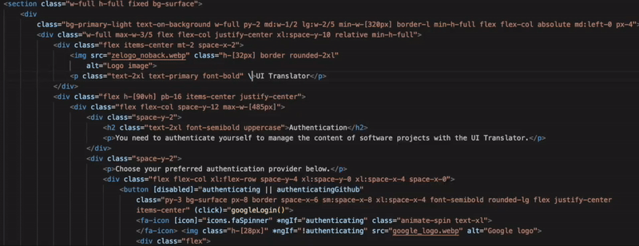
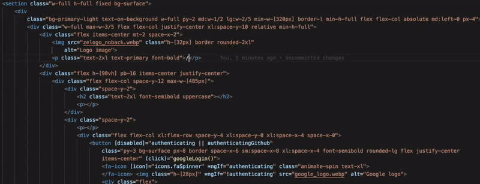
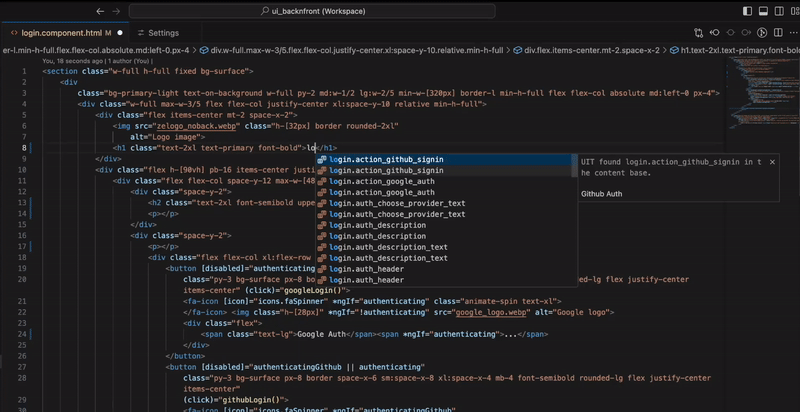

# Welcome to a new era of software localization!

Enhance your VSCode with the UI Translator capabilities and manage your content translations right from your code.

## Capabilities
The first two capabilities are meant to be used with [prepared content](#3-prepare-your-content) and the two last ones for adding new content without leaving your code file.  
### 1. Autocomplete by values
Values autocompletion is an easy way(Our preferred one in fact) to add [prepared](#3-prepare-your-content) messages to your code using the available content values.  



The Values completion trigger is `\`, just type it and start adding a value, the editor will prompt you with some matching messages.  

Depending on your i18n strategy and tool, you may also decide how exactly the UI Translator plugin should add your content in the code.
You can configure snippets per project workspace(or per root folder for multi root workspaces) and per language in the extension settings.  

The example above is triggered with `\`, and the `snippet` for `html` in that project was set to ```i18n="@@$id"``` as the i18n tool there was the `Angular` native one.  

### 2. Autocomplete by keys
Keys autocompletion is a handy way to add [prepared](#3-prepare-your-content) messages to your code using the available content keys.  



The Keys completion trigger is `/`, just type it and start adding a message ID, the editor will prompt you with some matching values.  

Depending on your i18n strategy and tool, you may also decide how exactly the UI Translator plugin should add your content in the code.
You can configure snippets per project workspace(or per root folder for multi root workspaces) and per language in the extension settings.  

The example above is triggered with `/`, and the `snippet` for `html` in that project was set to ```{ "$id" | translate }```.  

### 3. Convert static content to translatable messages
This feature aims to help you convert static content from your code into a translatable message without leaving your code.  


To convert a content, select it and then use the `Translate the selected Content` from the context menu or the shortcut `Ctrl`+`\`  
Then give that message an ID in the input displayed and hit `Enter`.  

Depending on your i18n strategy and tool, you may also decide how exactly the UI Translator plugin should add your content in the code.
You can configure snippets per project workspace(or per root folder for multi root workspaces) and per language in the extension settings.  

### 4. Easily add new messages by IDs 
This feature aims to help you adding new translatable messages in your content base without leaving your code.  



To add a new message, just type an ID then use the `Translate content with this ID` from the context menu or the shortcut `Ctrl`+`/`  
Then give that message a source content in the input displayed and hit `Enter`.  

**Important:** If you support complex structures in your messages like `ICU`, you should let your extraction tool provide the initial value. To do that just enter `.` when asked for source content and hit `Enter`.

Depending on your i18n strategy and tool, you may also decide how exactly the UI Translator plugin should add your content in the code.
You can configure snippets per project workspace(or per root folder for multi root workspaces) and per language in the extension settings.  

## Project setup
Before you can start enjoying modern content management in your code, you need to setup so that the UI Translator knows which content base to sync with this project.
### 1. Create the project content base
Content bases are hosted by the UI Translator and you have to create one before proceeding.  
. Open the [UI Translator Web App](https://app.uitranslator.com) and login using your favorite provider  
. Create a project(A content base)
. Click on the `LINK YOUR DEVELOPMENT SETUP` button to reveal your developer parameters.
### 2. Link the remote project
Back on the your VS code:  
. Open one of your code files  
. Locate the UI Translator Status on the status bar(Should be showing `CLI Missing`) and click it.  
. An information message will show with a `Install Globally` and `Install locally` actions, choose the one that works best for you(Global is recommended) and click it.  
. When the installation is done, click the UIT status again  
. An information message will show with a `Setup now` action, click it 
. Copy the access token revealed in the last action of [Step 1](#1-create-the-project-content-base), paste it at the prompt in the terminal and hit Enter.  
. Next, copy the project ID from [Step 1](#1-create-the-project-content-base), paste it and hit Enter.  
. Next, type your source content file(.json) path(`this file should exist`), and hit Enter.  
. Then, choose the messages extraction method, there are two options  
`Manually`: This may be the easiest way, we don't recommend it because the UI Translator will only use the content from the draft and will not have a way to separate content from different features.  
`Automatically`: This is the recommended way but you will need to provide an extraction command to finalize the setup.  
. Finally, if you chose `Automatically` in the previous step, type your content extraction command, it should output the result into the draft file as indicated by the CLI. It will be tested and if it works the setings will be sent to the server for validation.

### 3. Prepare your content
Now that your content base is ready, you can prepare some content that will be made available in autocompletion.
#### Scan the User-Interface picture 
If the project is still empty click on the `User-interface picture` card, the select your design image, indicate its name and start the extraction.  
#### Add a content manager
The content manager's role is to manage the content of the project, he/she can add, update, delete content, add translators, developers and other collaborators.  
#### Import existing content
You can also import existing content from JSON or ANDROID-XML files.

**Enjoy!**
